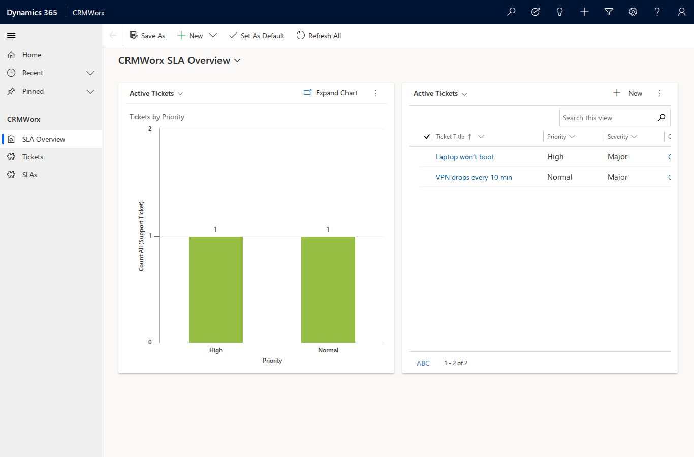
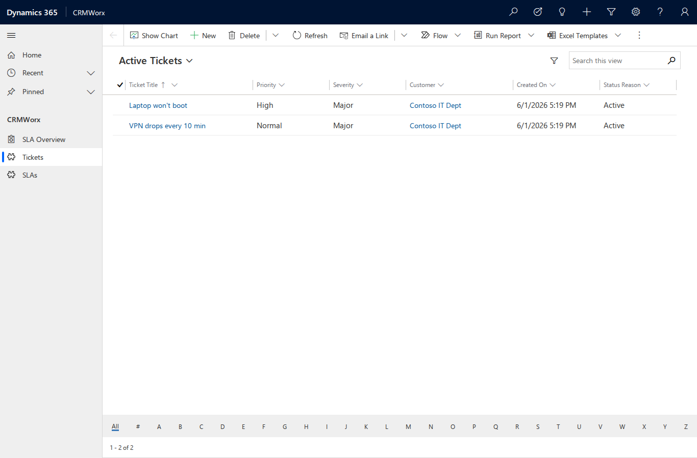
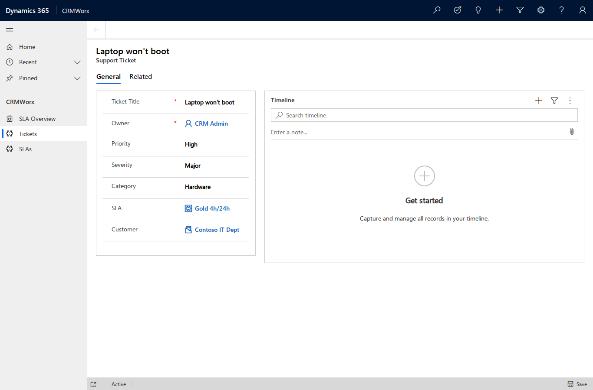

# CRMWorx walkthrough

This guide builds **CRMWorx** — an IT-company ticketing platform with SLA — end to
end using the `crm` CLI, demonstrating every command group. Each step shows the real
command and its captured output from a live run against a Dynamics 365 CE on-premises
v9.1 server (credentials redacted).

The build order is: **option sets → entities → attributes → relationships → seed data
→ read/verify → package → views → forms → charts → dashboard → BPF → sitemap & app
→ launch → (optional teardown)**.

## Prerequisites

- A reachable D365 CE on-prem server and NTLM credentials, saved as the active
  profile with `crm profile add` (see [How-to: profile](../how-to/profile.md)). The
  `add` step below pins the api-version and wires in the `CRMWorx` solution and `cwx`
  prefix.
- **A `CRMWorx` *unmanaged* solution and a publisher with prefix `cwx`.** Create both
  from the CLI — no web UI ([#34](https://github.com/Gharib89/crm/issues/34)).
  `--if-exists skip` makes re-runs a no-op:

  ```bash
  crm --json solution create-publisher --name crmworx --display CRMWorx --prefix cwx \
    --option-value-prefix 30000 --if-exists skip
  crm --json solution create --name CRMWorx --publisher crmworx --if-exists skip
  ```

  With a named profile active, these auto-wire `publisher_prefix=cwx` and
  `default_solution=CRMWorx` into it, so the metadata commands below target the
  `cwx` publisher and `CRMWorx` solution by default (pass `--no-set-default` to opt out).

## 1. Pre-flight & connection

Confirm reachability and identity. A non-zero exit (e.g. `401`) means the
`DOMAIN\username` credentials are wrong — fix them before continuing.

```bash
crm --json connection whoami
```

```json
{
  "ok": true,
  "data": {
    "@odata.context": ".../api/data/v9.1/$metadata#Microsoft.Dynamics.CRM.WhoAmIResponse",
    "BusinessUnitId": "00000000-0000-0000-0000-000000000002",
    "UserId": "00000000-0000-0000-0000-000000000017",
    "OrganizationId": "00000000-0000-0000-0000-000000000013"
  }
}
```

Save a **targeting profile** so every mutating metadata command lands in the `CRMWorx`
solution and uses the `cwx` schema-name prefix by default. `crm profile add` infers the
auth scheme from the URL (here NTLM), stores the secret, validates the credentials with
a WhoAmI call, and activates the profile:

```bash
crm --json profile add \
  --url https://crm.contoso.local/Contoso \
  --username alice --domain CONTOSO --password "$SECRET" \
  --api-version v9.1 \
  --default-solution CRMWorx --publisher-prefix cwx \
  --name crmworx
```

```json
{
  "ok": true,
  "data": {
    "profile": "crmworx",
    "auth_scheme": "ntlm",
    "credential_storage": "plaintext",
    "active": true,
    "user_id": "00000000-0000-0000-0000-000000000017",
    "api_version": "v9.1"
  }
}
```

Verify the active profile resolves the solution and prefix:

```bash
crm --json profile list
crm --json connection status
```

```json
{
  "ok": true,
  "data": [
    {
      "name": "crmworx", "active": true, "target": "on-prem",
      "default_solution": "CRMWorx", "publisher_prefix": "cwx"
    }
  ]
}
```

`connection status` confirms `active_profile: crmworx` with `default_solution: CRMWorx`
and `publisher_prefix: cwx`. From here, `metadata create-*` commands target `CRMWorx`
automatically (override per-command with `--solution`, or hard-fail when none resolves
with `--require-solution` / `CRM_REQUIRE_SOLUTION`).

## 2. Metadata build (option sets → entities → attributes → relationships)

### 2.1 Global option sets

CRMWorx uses four global (reusable) option sets. Preview the request first with
`--dry-run` to confirm the shape and that the `CRMWorx` solution is targeted — note the
`MSCRM.SolutionUniqueName: CRMWorx` header and the `GlobalOptionSetDefinitions` endpoint:

```bash
crm --json --dry-run metadata create-optionset \
  --name cwx_priority --display "CRMWorx Priority" \
  --option 1:Low --option 2:Normal --option 3:High --option 4:Critical \
  --if-exists skip
```

```json
{
  "ok": true,
  "data": {
    "_dry_run": true,
    "method": "POST",
    "url": ".../api/data/v9.1/GlobalOptionSetDefinitions",
    "headers": { "MSCRM.SolutionUniqueName": "CRMWorx" },
    "body": {
      "@odata.type": "Microsoft.Dynamics.CRM.OptionSetMetadata",
      "Name": "cwx_priority", "IsGlobal": true, "OptionSetType": "Picklist",
      "Options": [ { "Value": 1, "Label": { "...": "Low" } }, "...etc" ]
    }
  }
}
```

Now create all four. `--if-exists skip` makes each create idempotent (proven in §5):

```bash
crm --json metadata create-optionset --name cwx_priority --display "CRMWorx Priority" \
  --option 1:Low --option 2:Normal --option 3:High --option 4:Critical --if-exists skip
crm --json metadata create-optionset --name cwx_severity --display "CRMWorx Severity" \
  --option 1:Minor --option 2:Major --option 3:Critical --if-exists skip
crm --json metadata create-optionset --name cwx_ticketcategory --display "CRMWorx Category" \
  --option 1:Hardware --option 2:Software --option 3:Network --option 4:Access --if-exists skip
crm --json metadata create-optionset --name cwx_slatier --display "CRMWorx SLA Tier" \
  --option 1:Bronze --option 2:Silver --option 3:Gold --if-exists skip
```

Each returns `created: true` with the new metadata id, the target solution, and
`published: true`:

```json
{
  "ok": true,
  "data": {
    "created": true,
    "name": "cwx_priority",
    "metadata_id_url": ".../GlobalOptionSetDefinitions(a2ca6b21-...)",
    "solution": "CRMWorx",
    "published": true
  }
}
```

Verify all four landed:

```bash
crm --json metadata list-optionsets --custom-only | grep -oE 'cwx_[a-z]+' | sort -u
```

```text
cwx_priority
cwx_severity
cwx_slatier
cwx_ticketcategory
```

### 2.2 Custom entities

Two tables: **SLA Policy** (organization-owned reference data) and **Support Ticket**
(user-owned, note- and activity-enabled). The schema name is given in PascalCase with
the `cwx_` prefix; the server derives the lowercase logical name and the entity-set
(plural) name used by the Web API:

```bash
crm --json metadata create-entity \
  --schema-name cwx_SLA --display "SLA Policy" --display-collection "SLA Policies" \
  --primary-attr cwx_Name --primary-label "Policy Name" \
  --ownership OrganizationOwned --has-notes --if-exists skip

crm --json metadata create-entity \
  --schema-name cwx_Ticket --display "Support Ticket" --display-collection "Support Tickets" \
  --primary-attr cwx_Name --primary-label "Ticket Title" \
  --ownership UserOwned --has-notes --has-activities --if-exists skip
```

```json
{
  "ok": true,
  "data": {
    "created": true,
    "schema_name": "cwx_SLA",
    "logical_name": "cwx_sla",
    "entity_set_name": "cwx_slas",
    "primary_attribute": "cwx_name",
    "solution": "CRMWorx",
    "published": true
  }
}
```

**Note the `entity_set_name`** in each response — `cwx_slas` and `cwx_tickets`. These
plural names are what you pass to `entity`/`query` commands later (§3–§4), not the
logical name. Verify both tables exist:

```bash
crm --json metadata entities --custom-only | grep -oE 'cwx_(sla|ticket)\b' | sort -u
```

```text
cwx_sla
cwx_ticket
```

### 2.3 Attributes (all kinds)

Add columns to both tables. The `cwx_sla` table gets two integer bounds, a global
picklist, and a boolean:

```bash
crm --json metadata add-attribute cwx_sla --kind integer \
  --schema-name cwx_ResponseHours --display "Response Hours" --min 0 --max 720 --if-exists skip
crm --json metadata add-attribute cwx_sla --kind integer \
  --schema-name cwx_ResolutionHours --display "Resolution Hours" --min 0 --max 2160 --if-exists skip
crm --json metadata add-attribute cwx_sla --kind picklist \
  --schema-name cwx_Tier --display "Tier" --optionset-name cwx_slatier --if-exists skip
crm --json metadata add-attribute cwx_sla --kind boolean \
  --schema-name cwx_Active --display "Active" --true-label Yes --false-label No --if-exists skip
```

The `cwx_ticket` table gets a memo, three global picklists, and three datetimes:

```bash
crm --json metadata add-attribute cwx_ticket --kind memo \
  --schema-name cwx_Description --display "Description" --max-length 4000 --if-exists skip
crm --json metadata add-attribute cwx_ticket --kind picklist \
  --schema-name cwx_Priority --display "Priority" --optionset-name cwx_priority --if-exists skip
crm --json metadata add-attribute cwx_ticket --kind picklist \
  --schema-name cwx_Severity --display "Severity" --optionset-name cwx_severity --if-exists skip
crm --json metadata add-attribute cwx_ticket --kind picklist \
  --schema-name cwx_Category --display "Category" --optionset-name cwx_ticketcategory --if-exists skip
crm --json metadata add-attribute cwx_ticket --kind datetime \
  --schema-name cwx_OpenedOn --display "Opened On" --if-exists skip
crm --json metadata add-attribute cwx_ticket --kind datetime \
  --schema-name cwx_ResolvedOn --display "Resolved On" --if-exists skip
crm --json metadata add-attribute cwx_ticket --kind datetime \
  --schema-name cwx_DueBy --display "Due By" --if-exists skip
```

Each returns the created column with its resolved logical name and type:

```json
{
  "ok": true,
  "data": {
    "created": true,
    "entity": "cwx_ticket",
    "schema_name": "cwx_Priority",
    "logical_name": "cwx_priority",
    "attribute_type": "Picklist",
    "solution": "CRMWorx",
    "published": true
  }
}
```

A picklist that references a global option set binds to it through the
`GlobalOptionSet` navigation property. Confirm the binding by expanding it from the
metadata endpoint:

```text
attr: cwx_priority -> GlobalOptionSet.Name: cwx_priority
```

!!! note "Two CLI defects fixed during this step"
    Building these columns against the live 9.1 server surfaced two `add-attribute`
    bugs, fixed inline (commit `cf7d41d`):

    - **Integer bounds** were serialized as floats (`--min 0` → `0.0`), which the
      server rejected for an `Edm.Int32` column. Integer/bigint bounds are now coerced
      to integers.
    - **Global picklists** were sent as an inline option set with `IsGlobal=true`,
      which the server rejects on attribute create. They now bind via
      `GlobalOptionSet@odata.bind`; on-prem 9.1 requires the option set's `MetadataId`
      GUID for the bind (the `Name` alternate key is rejected), so the CLI resolves
      `Name → MetadataId` first.

### 2.4 Relationships (1:N + 1:N + N:N)

Three relationships wire the model together: SLA→Ticket and Account→Ticket (each a
1:N that creates a lookup column on the ticket), and Ticket↔SystemUser (an N:N
"watchers" link with an intersect table).

```bash
# SLA -> Ticket (creates the cwx_sla lookup on the ticket)
crm --json metadata create-one-to-many \
  --schema-name cwx_sla_cwx_ticket \
  --referenced-entity cwx_sla --referencing-entity cwx_ticket \
  --lookup-schema cwx_SLA --lookup-display "SLA Policy" --if-exists skip

# Account -> Ticket (creates the cwx_customerid lookup on the ticket)
crm --json metadata create-one-to-many \
  --schema-name cwx_account_cwx_ticket \
  --referenced-entity account --referencing-entity cwx_ticket \
  --lookup-schema cwx_CustomerId --lookup-display "Customer" --if-exists skip

# Ticket <-> SystemUser (N:N watchers)
crm --json metadata create-many-to-many \
  --schema-name cwx_ticket_systemuser \
  --entity1 cwx_ticket --entity2 systemuser \
  --intersect-entity cwx_ticket_systemuser --if-exists skip
```

A 1:N response reports the created relationship and the lookup column the server
generated on the referencing entity:

```json
{
  "ok": true,
  "data": {
    "created": true,
    "kind": "OneToMany",
    "schema_name": "cwx_sla_cwx_ticket",
    "referencing_attribute": "cwx_sla",
    "solution": "CRMWorx"
  }
}
```

Verify all three (note `metadata relationships` lists an entity's one-to-many,
many-to-one, *and* many-to-many links) and publish:

```bash
crm --json metadata relationships cwx_ticket \
  | grep -oE 'cwx_(sla_cwx_ticket|account_cwx_ticket|ticket_systemuser)' | sort -u
crm --json solution publish-all
```

```text
cwx_account_cwx_ticket
cwx_sla_cwx_ticket
cwx_ticket_systemuser
```

!!! note "Three more CLI defects fixed during this step"
    Creating relationships against the live server exposed (commits `c62d57a`,
    `980ab95`):

    - **Wrong endpoint** — `create-one-to-many`/`create-many-to-many` POSTed to
      `CreateOneToManyRequest`/`CreateManyToManyRequest`, which are SDK message names,
      not Web API segments ("Resource not found for the segment ..."). They now POST
      to the `RelationshipDefinitions` entity set with an `@odata.type` discriminator
      (the 1:N lookup is a `Lookup` deep insert).
    - **Invalid default menu** — the 1:N associated-menu defaulted to `UseLabel` with
      no label, which the server rejects. Default is now `UseCollectionName`.
    - **Incomplete read-back / listing** — `ReferencingAttribute` came back `null`
      (the read-back didn't cast to the relationship subtype), and `metadata
      relationships` omitted the many-to-one side. Both fixed.

## 3. Seed data

Records go to the **entity-set (plural) name** — `cwx_slas`, `cwx_tickets`, `accounts`
— not the logical name. First two SLA policies; each `create` returns the full row,
including its `cwx_slaid` GUID:

```bash
crm --json entity create cwx_slas --data '{"cwx_name":"Gold 4h/24h","cwx_responsehours":4,"cwx_resolutionhours":24,"cwx_tier":3,"cwx_active":true}'
crm --json entity create cwx_slas --data '{"cwx_name":"Bronze 24h/120h","cwx_responsehours":24,"cwx_resolutionhours":120,"cwx_tier":1,"cwx_active":true}'
```

A customer account:

```bash
crm --json entity create accounts --data '{"name":"Contoso IT Dept"}'
```

Now a ticket that **binds both lookups** with `@odata.bind`, using the SLA and account
GUIDs from above. The bind target is the *single-valued navigation property name* — for
these custom lookups it is the PascalCase **`cwx_SLA`** and **`cwx_CustomerId`**, not the
lowercase logical names (system lookups often match the lowercase attribute instead).
The name is case-sensitive; don't guess it — `crm metadata describe <entity>` hands you
the exact `bind_key`, or read it straight from the relationship:

```bash
crm --json query odata \
  "RelationshipDefinitions(SchemaName='cwx_account_cwx_ticket')/Microsoft.Dynamics.CRM.OneToManyRelationshipMetadata" \
  --select ReferencingAttribute,ReferencingEntityNavigationPropertyName
# -> ReferencingAttribute: cwx_customerid, NavigationPropertyName: cwx_CustomerId
```

```bash
crm --json entity create cwx_tickets --data '{
  "cwx_name":"Laptop won'\''t boot",
  "cwx_description":"Dell 5420 no POST after update",
  "cwx_priority":3, "cwx_severity":2, "cwx_category":1,
  "cwx_CustomerId@odata.bind":"/accounts(00000000-0000-0000-0000-000000000014)",
  "cwx_SLA@odata.bind":"/cwx_slas(00000000-0000-0000-0000-000000000001)"
}'
```

The response echoes the bound foreign keys:

```json
{ "ok": true, "data": {
    "cwx_ticketid": "a41cfedb-...",
    "cwx_name": "Laptop won't boot",
    "_cwx_sla_value": "00d955b7-...",
    "_cwx_customerid_value": "c2c130c3-..."
} }
```

Modify a record with `update` (PATCH) and `upsert` (PATCH with create-if-missing). With
no alternate key configured on the ticket, both target the record by id:

```bash
crm --json entity update cwx_tickets 00000000-0000-0000-0000-000000000011 \
  --data '{"cwx_resolvedon":"2026-06-01T12:00:00Z"}'
crm --json entity upsert cwx_tickets 00000000-0000-0000-0000-000000000015 \
  --data '{"cwx_resolvedon":"2026-06-01T15:30:00Z"}'
```

Both return `{"ok": true}`.

## 4. Read & verify

Four read paths. An **OData** query with a filter and projection:

```bash
crm --json query odata cwx_tickets \
  --filter "cwx_priority eq 3" --select cwx_name,cwx_severity --top 10
```

```json
{ "ok": true, "data": { "value": [
  { "cwx_name": "Laptop won't boot", "cwx_severity": 2 }
] } }
```

A **FetchXML** query (server-side XML query language) returning all tickets ordered by
name:

```bash
crm --json query fetchxml cwx_tickets --xml '
<fetch top="20">
  <entity name="cwx_ticket">
    <attribute name="cwx_name"/>
    <attribute name="cwx_priority"/>
    <order attribute="cwx_name"/>
  </entity>
</fetch>'
```

Returns both tickets (`Laptop won't boot` pri=3, `VPN drops every 10 min` pri=2).

A bulk **CSV export** to a file (the committed sample is
[`docs/artifacts/crmworx-tickets.csv`](../artifacts/crmworx-tickets.csv)):

```bash
crm data export cwx_tickets -o docs/artifacts/crmworx-tickets.csv \
  --select cwx_name,cwx_priority,cwx_severity,cwx_category
```

```text
output: docs/artifacts/crmworx-tickets.csv
format: csv
count: 2
```

And an **action/function** call — `RetrieveCurrentOrganization`:

```bash
crm --json action function RetrieveCurrentOrganization --params '{"AccessType":"Default"}'
```

```json
{ "ok": true, "data": { "Detail": {
  "FriendlyName": "Contoso",
  "OrganizationVersion": "9.1.44.15"
} } }
```

## 5. Package the solution

### Idempotency

Every metadata create uses `--if-exists skip`, so re-running the whole build is a safe
no-op. Re-running any create reports a skip rather than erroring or duplicating:

```bash
crm --json metadata create-optionset --name cwx_priority --display "CRMWorx Priority" \
  --option 1:Low --option 2:Normal --option 3:High --option 4:Critical --if-exists skip
crm --json metadata create-entity --schema-name cwx_SLA --display "SLA Policy" ... --if-exists skip
```

```json
{ "ok": true, "data": { "skipped": true, "exists": true } }
```

### Export

Export the unmanaged solution to a zip (committed sample:
[`docs/artifacts/crmworx.zip`](../artifacts/crmworx.zip)):

```bash
crm solution export CRMWorx -o docs/artifacts/crmworx.zip
```

```text
output: docs/artifacts/crmworx.zip
bytes: 83633
managed: False
solution: CRMWorx
action: ExportSolution
```

Verify the export contains the model. `solution components` returns component
**type + objectid (GUID)** rows — componenttype `9` is an option set, `1` is an
entity. CRMWorx contains all four option sets and both custom entities (plus the N:N
intersect entity):

```bash
crm --json solution components CRMWorx
# -> 8 components: 4 option sets (type 9) + 4 entities (type 1)
#    option sets  = cwx_priority, cwx_severity, cwx_ticketcategory, cwx_slatier
#    entities     = cwx_sla, cwx_ticket, cwx_ticket_systemuser (intersect), +1
```

!!! note "Solution-export defect fixed during this step"
    `solution export` only called `ExportSolutionAsync`, which **is not enabled on
    this on-prem 9.1 org** ("ExportSolutionAsync is not enabled for this org"). It now
    falls back to the synchronous `ExportSolution` action (which returns the zip bytes
    inline) when the async action is unavailable (commit `a87b8f2`). The response
    `action` field shows which path ran.

## 6. Views

A model-driven view is a **`savedquery`** row: `returnedtypecode` (the entity logical
name), `querytype` (`0` = public view), and two XML columns — `layoutxml` (grid columns
+ widths) and `fetchxml` (the query: columns, sort, filter). The grid's `object="<n>"`
attribute is the entity **ObjectTypeCode**, an org-specific integer — capture it live
rather than guessing (custom-entity OTCs on on-prem are typically ≥ 10000):

```bash
crm --json metadata entity cwx_ticket   # -> data.ObjectTypeCode = 10127
crm --json metadata entity cwx_sla       # -> data.ObjectTypeCode = 10126
```

!!! note "Column logical names ≠ option-set names"
    The picklist/lookup *columns* are `cwx_priority`, `cwx_severity`, `cwx_category`,
    `cwx_tier`, and the SLA lookup `cwx_sla` — **not** the global option-set names
    (`cwx_ticketcategory`, `cwx_slatier`). Confirm column logical names with
    `crm --json metadata attributes <entity>` before referencing them in FetchXml;
    the option set a picklist *binds to* can have a different name from the column.

Both XML blocks contain double quotes, so pass the record as a **JSON file**
(`--data-file`) rather than fighting shell quoting on `--data`. The LayoutXml + FetchXml
the server accepted for **Active Tickets** (newline-formatted here; stored single-line
in the JSON):

```xml
<grid name="resultset" object="10127" jump="cwx_name" select="1" icon="1" preview="1">
  <row name="result" id="cwx_ticketid">
    <cell name="cwx_name" width="220" />
    <cell name="cwx_priority" width="120" />
    <cell name="cwx_severity" width="120" />
    <cell name="cwx_customerid" width="180" />
    <cell name="createdon" width="140" />
    <cell name="statuscode" width="120" />
  </row>
</grid>
```

```xml
<fetch version="1.0" output-format="xml-platform" mapping="logical">
  <entity name="cwx_ticket">
    <attribute name="cwx_ticketid" />
    <attribute name="cwx_name" />
    <attribute name="cwx_priority" />
    <attribute name="cwx_severity" />
    <attribute name="cwx_customerid" />
    <attribute name="createdon" />
    <attribute name="statuscode" />
    <order attribute="cwx_name" descending="false" />
    <filter type="and">
      <condition attribute="statecode" operator="eq" value="0" />
    </filter>
  </entity>
</fetch>
```

`/tmp/cwx_view_active_tickets.json` wraps those two blocks as escaped single-line strings:

```json
{
  "name": "Active Tickets",
  "returnedtypecode": "cwx_ticket",
  "querytype": 0,
  "isdefault": false,
  "layoutxml": "<grid name=\"resultset\" object=\"10127\" ...></grid>",
  "fetchxml":  "<fetch ...><entity name=\"cwx_ticket\">...</entity></fetch>"
}
```

Preview the POST, guard against a duplicate (`savedquery` has no alternate key, so
filter by name + entity), then create:

```bash
crm --json --dry-run entity create savedqueries --data-file /tmp/cwx_view_active_tickets.json
crm --json query odata savedqueries \
  --filter "name eq 'Active Tickets' and returnedtypecode eq 'cwx_ticket'" --select name,savedqueryid
crm --json entity create savedqueries --data-file /tmp/cwx_view_active_tickets.json
```

```json
{ "ok": true, "data": { "savedqueryid": "00000000-0000-0000-0000-000000000005", "...": "..." } }
```

Two more views follow the same guard → create flow — **Tickets by Priority** (cwx_ticket;
LayoutXml leads with `cwx_priority`, FetchXml ordered by `cwx_priority`) and **Active SLAs**
(`"returnedtypecode": "cwx_sla"`, `object="10126"`; cells `cwx_name`, `cwx_tier`,
`cwx_responsehours`, `cwx_resolutionhours`):

```text
Active Tickets       00000000-0000-0000-0000-000000000005
Tickets by Priority  00000000-0000-0000-0000-000000000006
Active SLAs          00000000-0000-0000-0000-000000000007
```

Publish so the views surface in the app, then read them back (the build's three plus the
two auto-generated defaults D365 created with the entity):

```bash
crm --json solution publish-all
crm --json query odata savedqueries \
  --filter "returnedtypecode eq 'cwx_ticket' and querytype eq 0" --select name,savedqueryid
```

```text
Active Tickets             00000000-0000-0000-0000-000000000005
Tickets by Priority        00000000-0000-0000-0000-000000000006
Active Support Tickets     055e2e32-dc59-4190-a9ff-0a8c1d88cf7f   (auto-generated default)
Inactive Support Tickets   9665360a-d424-4fd5-8a16-7a979e9988a4   (auto-generated default)
```

## 7. Forms

Forms are also `systemform` rows: `objecttypecode` (entity logical name), `type`
(`2` = main, `7` = quickCreate), and a `formxml` layout. Authoring main FormXml from
scratch has a high 9.1 rejection rate, so **clone-and-augment** the auto-generated main
form instead — fetch it, inject controls for the custom columns, PATCH it back.

### Main form (clone-and-augment)

Fetch the auto-generated "Information" form and note its `formid` + FormXml length:

```bash
crm --json query odata systemforms \
  --filter "objecttypecode eq 'cwx_ticket' and type eq 2" --select name,formid,formxml
# -> Information | 8f0db50d-b90c-4b4d-9ecb-f16f9e7db491 | formxml 1625 chars
```

The auto form has one tab/two columns: `cwx_name` + `ownerid` on the left, the notes
control on the right. Keep all of it intact and add one `<row>` per missing custom
column to the first section, copying the existing `<cell>`/`<control>` shape and swapping
`datafieldname` + `classid`. The control `classid` is per **AttributeType** (read it from
`crm --json metadata attributes cwx_ticket`):

| AttributeType | Control `classid` |
| --- | --- |
| String | `{4273EDBD-AC1D-40d3-9FB2-095C621B552D}` |
| Picklist | `{3EF39988-22BB-4f0b-BBBE-64B5A3748AEE}` |
| Lookup | `{270BD3DB-D9AF-4782-9025-509E298DEC0A}` |

Each added row (every `<cell>` needs a unique GUID `id`):

```xml
<row>
  <cell id="{c0ffee00-…}">
    <labels><label description="Priority" languagecode="1033" /></labels>
    <control id="cwx_priority" classid="{3EF39988-22BB-4f0b-BBBE-64B5A3748AEE}"
             datafieldname="cwx_priority" />
  </cell>
</row>
```

Five rows added — `cwx_priority`, `cwx_severity`, `cwx_category` (Picklist), `cwx_sla`,
`cwx_customerid` (Lookup) — taking the FormXml 1625 → 2834 chars. Preview, PATCH, publish:

```bash
crm --json --dry-run entity update systemforms 8f0db50d-… --data-file /tmp/cwx_ticket_mainform_patch.json
crm --json entity update systemforms 8f0db50d-… --data-file /tmp/cwx_ticket_mainform_patch.json
crm --json solution publish-all
```

Read back proves the five columns are now on the form:

```bash
crm --json query odata systemforms --filter "formid eq 8f0db50d-…" --select formxml
# cwx_priority True | cwx_severity True | cwx_category True | cwx_sla True | cwx_customerid True
```

### Quick-create form (`type=7`)

A quick-create form is authored from scratch (it's small): a single 100%-width column with
`cwx_name`, `cwx_priority`, `cwx_customerid`. Guard, create, publish, read back:

```bash
crm --json query odata systemforms --filter "objecttypecode eq 'cwx_ticket' and type eq 7" --select name,formid
crm --json entity create systemforms --data-file /tmp/cwx_ticket_qc_form.json
crm --json solution publish-all
```

```json
{ "ok": true, "data": { "formid": "00000000-0000-0000-0000-000000000010", "...": "..." } }
```

!!! success "Quick-create via the Web API works on 9.1"
    On-prem 9.1's Web API accepted the `systemforms` POST with `type=7` on the first
    attempt — no manual-portal fallback was needed. Read-back confirms `cwx_priority`
    and `cwx_customerid` are present in the stored FormXml.

## 8. Charts

A chart is a **`savedqueryvisualization`** row with two XML columns: `datadescription`
(an aggregate FetchXML wrapped in `<datadefinition>` — the *what*) and
`presentationdescription` (a `<Chart>` serialization of the .NET Chart control — the
*how*). The `presentationdescription` has no schema; copy a canonical single-series
shape from MS Learn (`Sample charts`, op-9-1) and only swap the `ChartType`.

**Tickets by Priority** — group `cwx_ticket` by `cwx_priority`, count `cwx_ticketid`:

```xml
<datadefinition>
  <fetchcollection>
    <fetch mapping="logical" aggregate="true">
      <entity name="cwx_ticket">
        <attribute groupby="true" alias="groupby_column" name="cwx_priority" />
        <attribute alias="aggregate_column" name="cwx_ticketid" aggregate="count" />
      </entity>
    </fetch>
  </fetchcollection>
  <categorycollection>
    <category>
      <measurecollection><measure alias="aggregate_column" /></measurecollection>
    </category>
  </categorycollection>
</datadefinition>
```

The `presentationdescription` is the canonical `ChartType="Column"` block from the MS
Learn samples verbatim (series style + `<ChartAreas>` axes + `<Titles>`). Guard,
preview, create, publish, read back:

```bash
crm --json query odata savedqueryvisualizations \
  --filter "name eq 'Tickets by Priority' and primaryentitytypecode eq 'cwx_ticket'" --select name,savedqueryvisualizationid
crm --json --dry-run entity create savedqueryvisualizations --data-file /tmp/cwx_chart_priority.json
crm --json entity create savedqueryvisualizations --data-file /tmp/cwx_chart_priority.json
crm --json solution publish-all
crm --json query odata savedqueryvisualizations --filter "primaryentitytypecode eq 'cwx_ticket'" --select name,savedqueryvisualizationid
```

```text
Tickets by Priority | 00000000-0000-0000-0000-000000000012
```

The server accepted the chart on the first attempt. Keep that
`savedqueryvisualizationid` — the dashboard in §9 binds it.

## 9. Dashboard

A dashboard is a `systemform` with `type` = `0`. Its `formxml` lays out a grid of
components; every chart/grid component uses the same control `classid`
`{E7A81278-8635-4d9e-8D4D-59480B391C5B}` and is configured purely through `<parameters>`.
The load-bearing parameters are `<ChartGridMode>` (`Chart` vs `Grid`), `<VisualizationId>`
(the §8 chart GUID), and `<ViewId>` (the §6 view GUID that supplies the data).

**CRMWorx SLA Overview** — a single tab, one section, two side-by-side cells: the
"Tickets by Priority" chart and a list, both reading the "Active Tickets" view:

```xml
<cell colspan="1" rowspan="12" showlabel="false" id="{…}" auto="false">
  <control id="Chart1" classid="{E7A81278-8635-4d9e-8D4D-59480B391C5B}">
    <parameters>
      <TargetEntityType>cwx_ticket</TargetEntityType>
      <ChartGridMode>Chart</ChartGridMode>
      <ViewId>{00000000-0000-0000-0000-000000000005}</ViewId>          <!-- Active Tickets -->
      <IsUserView>false</IsUserView>
      <VisualizationId>{00000000-0000-0000-0000-000000000012}</VisualizationId>  <!-- chart -->
      <IsUserChart>false</IsUserChart>
      <EnableChartPicker>false</EnableChartPicker>
    </parameters>
  </control>
</cell>
```

Guard, create, publish, read back:

```bash
crm --json query odata systemforms --filter "name eq 'CRMWorx SLA Overview' and type eq 0" --select name,formid
crm --json entity create systemforms --data-file /tmp/cwx_dashboard.json
crm --json solution publish-all
crm --json query odata systemforms --filter "type eq 0 and name eq 'CRMWorx SLA Overview'" --select name,formid,formxml
```

```text
CRMWorx SLA Overview | 00000000-0000-0000-0000-000000000016
binds chart b7510172: True | binds view 72313649: True
```

Created on the first attempt. Keep the dashboard `formid` — the model-driven app in §11
adds it as a component.

## 10. Business process flow (documented manual fallback)

A BPF is a `workflows` row with `category` = `4` (BusinessProcessFlow), `type` = `1`
(Definition), `primaryentity` = `cwx_ticket`, and a `clientdata` JSON describing the
stages. This is the one artifact in this guide that **could not be built through the Web
API on 9.1** within a sane time-box — documented here honestly rather than faked.

### The CLI attempt (and its exact failure)

```bash
crm --json entity create workflows --data-file /tmp/cwx_bpf.json
# body: { "name":"Ticket Resolution", "uniquename":"cwx_ticketresolution",
#         "category":4, "type":1, "primaryentity":"cwx_ticket", "languagecode":1033 }
```

```json
{ "ok": false, "error": "An unexpected error occurred.",
  "meta": { "status": 500, "code": "0x80040216" } }
```

### Why it's blocked on 9.1

1. **`cwx_ticket.IsBusinessProcessEnabled` is `false`**, and MS Learn states *"Enabling a
   table for business process flow is a one-way process. You can't reverse it."* This guide
   does not force an irreversible metadata mutation over the API.
2. **`clientdata` has no documented hand-authorable schema.** Reverse-engineering an
   existing on-org BPF shows it is a ~6.8 KB serialization of internal
   `Microsoft.Crm.Workflow.ObjectModel` classes
   (`WorkflowStep → EntityStep → StageStep → StepStep → ControlStep`) whose IDs must align
   with platform-generated `processstage` rows.
3. **MS Learn documents only the visual designer + a GET to retrieve** the definition — no
   supported "create a BPF via Web API POST" path for on-prem 9.1.

### Manual-portal fallback (the supported path)

Settings → **Processes** → **New** → Category **Business Process Flow** → Entity
**`cwx_ticket`** → add stages **New → In Progress → Resolved** → **Activate**. Creating the
BPF through the designer also performs the irreversible `IsBusinessProcessEnabled` flip on
`cwx_ticket` for you.

!!! warning "BPF was not created via the CLI"
    Every other artifact in this guide was built live through `crm`. The BPF is the lone
    exception on 9.1: it requires the portal designer (or a managed-solution import). This
    is tracked in [issue #37](https://github.com/Gharib89/crm/issues/37) (*"BPF creation via
    Web API on D365 CE on-prem 9.1"*); if a supported API recipe surfaces, a future `crm bpf`
    command can emit it. The app in §11 therefore binds the views, forms, chart and dashboard
    — not a BPF.

## 11. Sitemap & model-driven app

The capstone: an `appmodules` row (the app), a `sitemaps` row (its navigation), and the
`AddAppComponents` action to bind everything built so far. Three on-prem-9.1 quirks were
discovered live and each matters.

### App module

`appmodules` requires a non-null `webresourceid` (the tile icon). The platform ships a
default icon (`953b9fac-1e5e-e611-80d6-00155ded156f`,
`msdyn_/Images/AppModule_Default_Icon.png`); CRMWorx instead uses its own `cwx_` SVG web
resource so the app is self-contained:

```bash
# 1. create + publish a cwx_ icon web resource (type 11 = SVG)
crm --json entity create webresourceset --data-file /tmp/cwx_webresource.json   # -> 9188010c-…
crm --json solution publish-all
```

!!! warning "appmodule create: use `--no-return`"
    The default `Prefer: return=representation` makes the POST read the new row straight
    back — but an **unpublished** appmodule isn't yet readable, so the whole call reports
    `appmodule With Id = … Does Not Exist` *after* having created the row (which then
    collides on the next attempt). Create with `--no-return` and read the id back with the
    `RetrieveUnpublishedMultiple` function instead.

```bash
crm --json entity create appmodules --no-return --data-file /tmp/cwx_app.json
crm --json query odata "appmodules/Microsoft.Dynamics.CRM.RetrieveUnpublishedMultiple()" --select name,uniquename,appmoduleid
# -> CRMWorx | cwx_crmworx | 00000000-0000-0000-0000-000000000008
```

`/tmp/cwx_app.json`: `{ "name":"CRMWorx", "uniquename":"cwx_crmworx", "clienttype":4,
"navigationtype":0, "webresourceid":"9188010c-…" }` (`clienttype` 4 = Unified Interface,
confirmed against the org's existing apps).

### Sitemap

A `sitemaps` row whose `sitemapnameunique` equals the app's `uniquename` auto-associates
with the app. SiteMapXml: one Area → one Group → three SubAreas (the dashboard, then the
two tables by `Entity=`):

```xml
<SiteMap>
  <Area Id="cwx_area_service" Title="CRMWorx" ShowGroups="true">
    <Group Id="cwx_group_main" Title="CRMWorx">
      <SubArea Id="cwx_sa_dashboard" Title="SLA Overview" DefaultDashboard="e29005b6-…" />
      <SubArea Id="cwx_sa_tickets" Entity="cwx_ticket" Title="Tickets" />
      <SubArea Id="cwx_sa_slas" Entity="cwx_sla" Title="SLAs" />
    </Group>
  </Area>
</SiteMap>
```

```bash
crm --json entity create sitemaps --no-return --data-file /tmp/cwx_sitemap.json   # -> 2ef3183b-…
```

### Bind components

!!! note "AddAppComponents takes **typed entity references**, not `{Type, Id}`"
    On 9.1 the `Components` array is a collection of entity references — each element is the
    component's primary-key field plus its `@odata.type`, e.g.
    `{ "savedqueryid":"…", "@odata.type":"Microsoft.Dynamics.CRM.savedquery" }`. The
    `componenttype` integers (entity 1, view 26, chart 59, form 60, sitemap 62) are the
    *read-side* `appmodulecomponent.componenttype` values, **not** the action payload shape.

```bash
crm --json action invoke AddAppComponents --body-file /tmp/cwx_addcomponents.json
```

The body binds 8 components: the sitemap, the 3 views, the augmented main form +
quick-create + dashboard (all `systemform`), and the chart. Then publish, validate, and
read the components back. `ValidateApp` / `RetrieveAppComponents` are **functions** whose
`AppModuleId` is an `Edm.Guid` — pass it **unquoted** by calling the function on the URL
path (the CLI's `--params` would quote it as a string and the server rejects that):

```bash
crm --json solution publish-all
crm --json query odata "ValidateApp(AppModuleId=79bdfbec-…)"
crm --json query odata "RetrieveAppComponents(AppModuleId=79bdfbec-…)"
```

```text
ValidationSuccess = True        # app is valid
RetrieveAppComponents -> 8 items (3 view, 1 chart, 3 form/dashboard, 1 sitemap)
```

!!! note "Tables surface through the sitemap, not AddAppComponents"
    `AddAppComponents` only accepts record-backed components (its `Components` parameter is
    a `crmbaseentity` collection), so `cwx_ticket` / `cwx_sla` *table metadata* can't be
    bound through it. The two tables reach the app via the sitemap's `Entity=` subareas;
    `ValidateApp` notes this as a non-blocking warning and still returns
    `ValidationSuccess = True`.

## 12. Launch & verify

The app launches at:

```text
http://internalcrm.contoso.local/Contoso/main.aspx?appid=00000000-0000-0000-0000-000000000008
```

The running app, captured live (headless Chromium over NTLM):



The dashboard (§9) renders both components: the "Tickets by Priority" chart (§8) and the
"Active Tickets" list (§6), with the CRMWorx sitemap (§11) in the left nav — SLA Overview,
Tickets, SLAs.



The **Tickets** area shows the §6 "Active Tickets" view with exactly the columns its
LayoutXml defined (Ticket Title, Priority, Severity, Customer, Created On, Status Reason).



Opening a ticket shows the §7 clone-and-augmented main form: every injected field is
present and populated — Priority, Severity, Category, the SLA lookup, and Customer.

!!! note "NTLM in headless automation"
    A first navigation attempt failed with `net::ERR_INVALID_AUTH_CREDENTIALS`: Playwright
    suppresses the native NTLM prompt, so the browser needs the credentials supplied
    *programmatically*. These shots were taken by launching Chromium with
    `--auth-server-allowlist=*contoso.local` and an `http_credentials` context — the documented
    way to negotiate NTLM headless. Credentials were supplied to the browser at run time and
    never appear in the capture.

The server-side read-back corroborates that the app and its components exist on the server
regardless of the browser:

```bash
crm --json query odata appmodules --filter "uniquename eq 'cwx_crmworx'" --select name,appmoduleid,uniquename
crm --json query odata "RetrieveAppComponents(AppModuleId=79bdfbec-…)"
crm --json query odata "ValidateApp(AppModuleId=79bdfbec-…)"
```

```text
CRMWorx | 00000000-0000-0000-0000-000000000008 | cwx_crmworx
RetrieveAppComponents -> 8 components
ValidateApp           -> ValidationSuccess = True
```

## 13. Promoted commands

The high-reuse, small-predictable-XML pieces — public views and the model-driven
app/sitemap — are promoted from raw `entity create` calls into first-class command groups
(`crm view`, `crm app`), each backed by `requests_mock` unit tests. Their generators emit
exactly the shapes the live server accepted in §6 and §11.

**`crm view create`** rebuilds the "Active SLAs" view (here under a `(cmd)` suffix so it
sits alongside the §6 original) — it generates the LayoutXml + FetchXml, guards on
name+entity, creates, and publishes:

```bash
crm --json view create cwx_sla --name "Active SLAs (cmd)" --otc 10126 \
  --column "cwx_name:240" --column "cwx_tier:140" --filter-active --if-exists skip
```

```json
{ "ok": true, "data": { "created": true,
  "savedqueryid": "00000000-0000-0000-0000-000000000004", "published": true } }
```

**`crm app create`** is idempotent — run against the app from §11 it reports a skip via the
same existence guard, no duplicate:

```bash
crm --json app create --name CRMWorx --unique-name cwx_crmworx --if-exists skip
```

```json
{ "ok": true, "data": { "skipped": true,
  "appmoduleid": "00000000-0000-0000-0000-000000000008" } }
```

`crm app add-components` and `crm app set-sitemap` round out the group, emitting the
typed-entity-reference `AddAppComponents` body and the `sitemapnameunique`-linked sitemap
that §11 proved on 9.1. `crm app create` always sets the required `webresourceid` to the
platform default icon.

## Capability coverage

Every `crm` command group is exercised by this walkthrough:

| Group | Exercised by |
| --- | --- |
| profile | §1 — `add` (saves + activates the `crmworx` targeting profile), `list` |
| connection | §1 — `whoami`, `status` |
| session | `session info` (active profile, current entity set, last query) |
| metadata | §2 — `create-optionset`, `create-entity`, `add-attribute`, `create-one-to-many`, `create-many-to-many`, `relationships`, `list-optionsets`, `entities` |
| entity | §3 — `create`, `update`, `upsert` (lookups via `@odata.bind`); §6–§11 — `create`/`update` on `savedqueries`, `systemforms`, `savedqueryvisualizations`, `webresourceset`, `appmodules`, `sitemaps` (`--no-return` for appmodule/sitemap) |
| query | §4 — `odata` + `fetchxml`; §6–§12 — `odata` over interface tables + `RetrieveUnpublishedMultiple` / `ValidateApp` / `RetrieveAppComponents` functions |
| data | §4 — `export` (CSV) |
| action | §4 — `function RetrieveCurrentOrganization`; §11 — `invoke AddAppComponents` |
| solution | §5–§11 — `publish-all`, `export`, `components`, `list`, `info` |
| (interface) | §6 views · §7 forms · §8 charts · §9 dashboard · §10 BPF (manual fallback, [#37](https://github.com/Gharib89/crm/issues/37)) · §11 sitemap + model-driven app · §12 launch |
| view | §13 — `crm view create` (promoted savedquery generator) |
| app | §13 — `crm app create` / `add-components` / `set-sitemap` (promoted appmodule + sitemap) |

## Teardown (optional — full reset for a clean replay)

> **Destructive.** Each command requires `--yes`; the `destructive_op_gate` PreToolUse
> hook blocks them otherwise. Deleting an entity drops the table **and every row in
> it**. Run these only to reset the org for a clean replay — CRMWorx is otherwise left
> deployed.

Reverse order — interface artifacts first, then records-with-their-tables, then
relationships and attributes go with the entities, leaving only the global option sets to
delete last. The **app module, global sitemap, and icon web resource are independent** —
they do **not** cascade when the entities are dropped, so delete them explicitly. Views,
forms, the chart and the dashboard **do** cascade with their owning entity, so they need no
separate delete.

```bash
# Interface teardown (before dropping the tables) — these don't cascade with the entity
crm --json entity delete appmodules 00000000-0000-0000-0000-000000000008 --yes   # the model-driven app
crm --json entity delete sitemaps   00000000-0000-0000-0000-000000000003 --yes   # the app sitemap
crm --json entity delete webresourceset 00000000-0000-0000-0000-000000000009 --yes  # the cwx_ app icon
# (views/forms/chart/dashboard are deleted automatically with their owning entity below)

crm --json metadata delete-entity cwx_ticket --yes   # drops the table + all rows + its relationships + its views/forms/chart/dashboard
crm --json metadata delete-entity cwx_sla --yes
crm --json metadata delete-optionset cwx_priority --yes
crm --json metadata delete-optionset cwx_severity --yes
crm --json metadata delete-optionset cwx_ticketcategory --yes
crm --json metadata delete-optionset cwx_slatier --yes
```

After teardown, `crm --json metadata entities --custom-only | grep -c cwx_` returns `0`.
The entire guide then replays from clean by re-running §2 onward — every create is
idempotent, so a partial replay is safe to resume.

This teardown + replay was run once against the live server to validate it: the
deletes dropped both tables and all four option sets (entities → `0`), then the full
§2–§3 build was re-applied, leaving CRMWorx deployed with fresh metadata ids. One note —
`delete-entity` has no `--if-exists skip`, so deleting an already-removed table returns
an error (`EntityMetadata ... does not exist`) rather than a no-op; delete in the
documented order and it won't recur.
